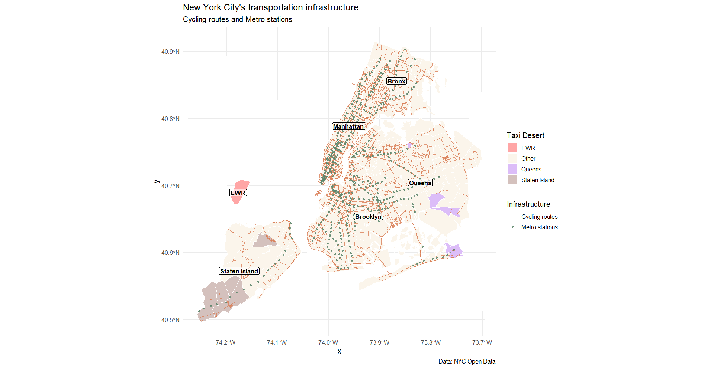
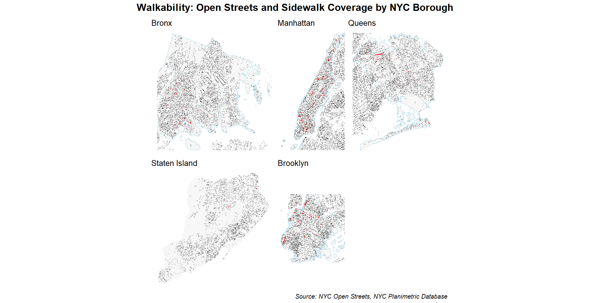

# Introduction: research question and motivation.

This project explores urban accessibility and mobility inequality in New York City. 
**The main research question is:**

How evenly is transportation accessibility distributed across New York City neighborhoods — and which neighborhoods can be considered “transportation deserts”?

To answer this question, we examine three interrelated aspects of mobility:

**Taxi accessibility** — an analysis of trip frequency and cost to identify areas with limited service or high transportation costs.

**Metro and bicycle** infrastructure - How public transportation (subway, buses) and bicycle infrastructure complement or replace taxi rides.

**Pedestrian perspective** - a visual analysis identifying areas of limited transportation service in NYC by comparing walkability coverage against actual taxi trip density.


# Data processing

## Data import and cleaning process.

Datasets that were used:

[NYC Taxi Trip Data](https://www.nyc.gov/site/tlc/about/tlc-trip-record-data.page) (2024) — containing millions of records from yellow and green taxi trips.

[Taxi Zone Shapefile](https://www.kaggle.com/datasets/ahmadrezarostamani/nyc-taxi-zone-shapefile) — defining geographic boundaries and boroughs for each taxi zone.

[Open Streets Locations](https://data.cityofnewyork.us/Health/Open-Streets-Locations/uiay-nctu/about_data)

[Planimetric Database: Sidewalk](https://data.cityofnewyork.us/City-Government/NYC-Planimetric-Database-Sidewalk/vfx9-tbb6)

[MTA Subway Stations](https://data.ny.gov/Transportation/MTA-Subway-Stations/39hk-dx4f/about_data)

[Bicycle Parking](https://data.cityofnewyork.us/Transportation/Bicycle-Parking-Map-/bzg2-2abf)

[New York City Bike Routes](https://data.cityofnewyork.us/dataset/New-York-City-Bike-Routes-Map-/9e2b-mctv)


## Taxi accessibility - by Valeriia Mikhailishyna


The process of importing, cleaning, and preparing the data involved several **key steps:**

### Loading Required Packages
```{r}
#| eval: true
#| echo: true
#| output: false

if (!require("pacman")) install.packages("pacman")

pacman::p_load(
  terra,
  sf,
  tidyverse,
  ggplot2,
  arrow,
  dplyr,
  scales,
  terra,
  giscoR,
  ggtern,
  elevatr,
  png,
  rayshader,
  magick,
  furrr,
  here,
  future,
  rvest,
  RSelenium,
  netstat,
  janitor,
  extrafont,
  rnaturalearth,
  glue,
  exactextractr,
  jsonlite,
  readr,
  duckdb,
  patchwork,
  ggiraph
)
```


### Data import and cleaning process.
The taxi zones shapefile was read using read_sf() and cleaned for easier processing.
```{r}
#| eval: true
#| echo: true
#| output: false
NYC_shapes <- read_sf("data/taxi_zones/taxi_zones.shp") |> 
  clean_names() |> 
  select(location_id, borough, zone)
```
The yellow and green taxi trip datasets were stored in Parquet format and opened with the arrow package.
```{r}
#| eval: true
#| echo: true
#| output: false

yellow_ds <- open_dataset("data/taxi_2024/yellow")
green_ds <- open_dataset("data/taxi_2024/green")
```
Since the yellow and green taxi datasets use slightly different naming conventions, their columns were standardized to a common schema:
```{r}
#| eval: true
#| echo: true
#| output: false
yellow_ds <- yellow_ds |>
  mutate(
    pickup_datetime = tpep_pickup_datetime,
    dropoff_datetime = tpep_dropoff_datetime,
    pu_location_id = PULocationID,
    do_location_id = DOLocationID
  ) |>
  select(
    pickup_datetime,
    dropoff_datetime,
    trip_distance,
    fare_amount,
    pu_location_id,
    do_location_id,
    passenger_count
  )

green_ds <- green_ds |>
  mutate(
    pickup_datetime = lpep_pickup_datetime,
    dropoff_datetime = lpep_dropoff_datetime,
    pu_location_id = PULocationID,
    do_location_id = DOLocationID
  ) |>
  select(
    pickup_datetime,
    dropoff_datetime,
    trip_distance,
    fare_amount,
    pu_location_id,
    do_location_id,
    passenger_count
  )

taxi_ds <- union_all(yellow_ds, green_ds)
```

Key taxi metrics were aggregated by pickup zone (pu_location_id):
```{r}
#| eval: true
#| echo: true
#| output: false
taxi_df <- taxi_ds |>
  summarise(
    trips = n(),
    avg_distance = mean(trip_distance, na.rm = TRUE),
    avg_fare = mean(fare_amount, na.rm = TRUE),
    avg_passengers = mean(passenger_count, na.rm = TRUE),
    .by = pu_location_id
  ) |>
  ungroup()|>
  collect()

NYC_shapes <- NYC_shapes |>
  summarise(geometry = st_union(geometry),
            .by = c(location_id, borough, zone)) |>
  ungroup()
```

The aggregated taxi metrics were linked with the geographic boundaries of each taxi zone.
To identify underserved areas, a custom transport desert index was computed as a combination of low trip frequency and high fare values:
```{r}
#| eval: true
#| echo: true
#| output: false
taxi_geo <- taxi_df |>
  left_join(
    NYC_shapes,
    by = c("pu_location_id" = "location_id")
  ) |>
  mutate(
    desert_index = rescale(-trips) + rescale(avg_fare),
    transport_desert = desert_index > quantile(desert_index, 0.9, na.rm = TRUE)
  )|> 
  filter(!is.na(borough))
```

The resulting dataset was converted into an sf object for mapping and analysis.
Top 10 “transport desert” zones were extracted for focused analysis:
```{r}
#| eval: true
#| echo: true
#| output: false
top_10_desert_zone <- taxi_geo |>
  filter(transport_desert) |>
  arrange(desc(desert_index)) |>
  select(borough, zone, trips, avg_fare, desert_index) |>
  head(10)

taxi_geo <- st_as_sf(taxi_geo)

top_10_sf <- taxi_geo |>
  semi_join(top_10_desert_zone, by = c("borough", "zone"))

taxi_geo <- taxi_geo |> 
  mutate(
    fill_color = case_when(
      zone %in% top_10_desert_zone$zone & borough %in% top_10_desert_zone$borough ~ borough,
      TRUE ~ "Other"
    )
  )


taxi_geo <- st_as_sf(taxi_geo)

borough_labels <- taxi_geo |>
  group_by(borough) |>
  summarise(geometry = st_union(geometry)) |>
  st_centroid()
```


## Public transport and cycling infrastructure - by Liliia Chervonetska
Preparing data for bikes parking and subway stations
```{r}
#| eval: true
#| echo: true
#| output: false

nyc_map <- sf::read_sf("data/nyc/geo_export_3debb725-2d55-475f-bd5d-8d44be82a8a1.shp")


subway_stations <- sf::read_sf("data/subways/geo_export_b0505220-29c5-4aeb-96e6-1850dc5da04a.shp")

files <- list.files("data/bicycle", pattern = "\\.csv$", full.names = TRUE)
data_list <- lapply(files, read_csv)

bikes_parking <- sf::read_sf("data/bikes_parking/geo_export_596dfc9e-2f4c-425f-9d59-47435119e22d.shp")

bikes <- bind_rows(data_list)

bikes_clean <- bikes |>
  filter(
    !is.na(start_lat), !is.na(start_lng),
    !is.na(end_lat), !is.na(end_lng)
  )


map_crs <- st_crs(nyc_map)

bike_routes <- sf::read_sf("data/bike_routes/geo_export_7d1589cb-3cd5-4bda-8f52-80709036f004.shp")


borough_shapes <- NYC_shapes |>
  group_by(borough) |>
  summarise(geometry = st_union(geometry)) |>
  ungroup()

```


To combine the data correctly, I renamed our data. I also counted the total number of parking spaces for bicycles and metro stations. Then I correlated the data with our area to show the results correctly.
```{r}
#| eval: true
#| echo: true
#| output: false
subway_stations <- st_transform(subway_stations, st_crs(NYC_shapes))


subway_stations <- subway_stations |> 
  mutate(borough = case_when(
    borough == "Bk" ~ "Brooklyn",
    borough == "Bx" ~ "Bronx",
    borough == "M" ~ "Manhattan",
    borough == "Q" ~ "Queens",
    borough == "SI" ~ "Staten Island",
    TRUE ~ borough
  ))

bikes_parking <- bikes_parking |> 
  mutate(borough = case_when(
    borough == "BK" ~ "Brooklyn",
    borough == "BX" ~ "Bronx",
    borough == "MN" ~ "Manhattan",
    borough == "QN" ~ "Queens",
    borough == "SI" ~ "Staten Island",
    TRUE ~ borough
  ))

bikes_parking <- st_transform(bikes_parking, st_crs(NYC_shapes))


subway_count <- subway_stations |>
  st_join(NYC_shapes, join = st_intersects) |>        
  st_drop_geometry() |>
  select(location_id, borough = borough.y, zone) |>
  group_by(location_id, borough, zone) |>
  summarise(subway_stations = n()) |>
  ungroup()


parking_count <- bikes_parking |>
  st_join(NYC_shapes, join = st_intersects) |>        
  st_drop_geometry() |>
  select(location_id, borough = borough.y, zone) |> 
  group_by(location_id, borough, zone) |>
  summarise(parking_count = n()) |>
  ungroup()


transport_summary <- subway_count |>
  full_join(parking_count, by = c("location_id", "borough", "zone")) |>
  full_join(
    taxi_df, 
    by = c("location_id" = "pu_location_id")
  ) |>
  replace_na(list(
    subway_stations = 0,
    parking_count = 0,
    trips = 0
  ))


NYC_shapes_area <- NYC_shapes |> 
  mutate(area_km2 = as.numeric(st_area(geometry)) / 10^6)

transport_density <- transport_summary |>
  left_join(NYC_shapes_area |> st_drop_geometry(), by = c("location_id", "borough", "zone")) |>
  mutate(
    subway_density = subway_stations / area_km2,
    parking_density = parking_count / area_km2,
    taxi_density = trips / area_km2
  ) |>
  pivot_longer(
    cols = c(subway_density, parking_density, taxi_density),
    names_to = "transport_type",
    values_to = "density"
  )


transport_density <- transport_density|>
  filter(!is.na(borough), borough != "NA")


transport_sum <- transport_density |> 
  group_by(borough, transport_type) |> 
  summarise(total_density = sum(density, na.rm = TRUE))
```

## Pedestrian perspective - by Mariia Karas

```{r}
#| eval: false
open_spaces_tbl <- tibble(read_csv("C:/Users/user/Documents/r4ds/Open_Streets_Locations_20251020.csv")) |>
  clean_names() 

open_spaces_tbl <- open_spaces_tbl |> 
  st_as_sf(wkt = "the_geom", crs = 4326)
```


```{r}
#| eval: true
#| echo: true
#| output: false

boroughs_sf <- st_read("data/nybb/nybb.shp") |> 
  st_transform(4326)

sidewalks_sf <- st_read("data/sidewalk/geo_export_6771cc9a-353a-474c-902c-8107243aabb5.shp") |>
  st_transform(4326) |> 
  glimpse()
```


```{r}
#| eval: false


brooklyn_sf <- boroughs_sf |> 
  filter(BoroName == "Brooklyn") 

sidewalks_brooklyn <- sidewalks_sf |>
  st_make_valid() |>
  st_crop(brooklyn_sf)

st_write(sidewalks_brooklyn, "sidewalks_brooklyn_1.shp")

# sidewalks_brooklyn <- st_read("sidewalks_brooklyn_1.shp") |> 
#   st_transform(4326)

sidewalks_brooklyn <- sidewalks_brooklyn |> 
  mutate(borough_name = "Brooklyn")

open_spaces_brooklyn <- open_spaces_tbl |>
  filter(borough_name == "Brooklyn")             

brooklyn <- ggplot() +
  geom_sf(data = brooklyn_sf, fill = "grey97", color = "lightblue") +
  geom_sf(data = sidewalks_brooklyn, fill = "black", color = NA) +
  geom_sf(data = open_spaces_brooklyn, color = "red", size = 0.6) +
  labs(title = "Brooklyn") +
  theme_void()

#                               ------------------------------------------------

brooklyn_area <- brooklyn_sf |>
  st_transform(2263) |> 
  mutate(borough_area = units::set_units(st_area(geometry), "km^2")) |>
  st_drop_geometry() |>
  select(BoroName, borough_area) |> 
  rename(borough_name = BoroName)


brooklyn_sidewalk_summary <- sidewalks_brooklyn |>
  st_make_valid() |>
  st_drop_geometry() |>
  group_by(borough_name) |>
  summarise(total_sidewalk_length = sum(shape_leng, na.rm = TRUE)) |>
  ungroup() 

brooklyn_walkability_index_tbl <- brooklyn_area |>
  left_join(brooklyn_sidewalk_summary, by = "borough_name") |>
  mutate(
    walkability_index = total_sidewalk_length / as.numeric(borough_area),
    walkability_pct = scales::rescale(walkability_index, to = c(0, 100))
  )
  
```


```{r}
#| eval: false
manhattan_sf <- boroughs_sf |>
  filter(BoroName == "Manhattan")

sidewalks_manhattan <- sidewalks_sf |>
  st_make_valid() |>
  st_crop(manhattan_sf) 

sidewalks_manhattan <- sidewalks_manhattan |> 
  mutate(borough_name = "Manhattan")

open_spaces_manhattan <- open_spaces_tbl |>
  filter(borough_name == "Manhattan")

manhattan <- ggplot() +
  geom_sf(data = manhattan_sf, fill = "grey97", color = "lightblue") +
  geom_sf(data = sidewalks_manhattan, fill = "black", color = NA) +
  geom_sf(data = open_spaces_manhattan, color = "red", size = 0.6) +
  labs(title = "Manhattan")+
  theme_void()

#                               ------------------------------------------------

manhattan_area <- manhattan_sf |>
  st_transform(2263) |> 
  mutate(borough_area = units::set_units(st_area(geometry), "km^2")) |>
  st_drop_geometry() |>
  select(BoroName, borough_area) |> 
  rename(borough_name = BoroName)


manhattan_sidewalk_summary <- sidewalks_manhattan |>
  st_make_valid() |>
  st_drop_geometry() |>
  group_by(borough_name) |>
  summarise(total_sidewalk_length = sum(shape_leng, na.rm = TRUE)) |>
  ungroup() 

manhattan_walkability_index_tbl <- manhattan_area |>
  left_join(manhattan_sidewalk_summary, by = "borough_name") |>
  mutate(
    walkability_index = total_sidewalk_length / as.numeric(borough_area),
    walkability_pct = scales::rescale(walkability_index, to = c(0, 100))
  )


# bronx_sf--------------------------------------------------------------------------

bronx_sf <- boroughs_sf |>
  filter(BoroName == "Bronx")

sidewalks_bronx <- sidewalks_sf |>
  st_make_valid() |>
  st_crop(bronx_sf) 

sidewalks_bronx <- sidewalks_bronx |> 
  mutate(borough_name = "Bronx")

open_spaces_bronx <- open_spaces_tbl |>
  filter(borough_name == "Bronx")

bronx <- ggplot() +
  geom_sf(data = bronx_sf, fill = "grey97", color = "lightblue") +
  geom_sf(data = sidewalks_bronx, fill = "black", color = NA) +
  geom_sf(data = open_spaces_bronx, color = "red", size = 0.6) +
  labs(title = "Bronx")+
  theme_void()

#                               ------------------------------------------------

bronx_area <- bronx_sf |>
  st_transform(2263) |> 
  mutate(borough_area = units::set_units(st_area(geometry), "km^2")) |>
  st_drop_geometry() |>
  select(BoroName, borough_area) |> 
  rename(borough_name = BoroName)


bronx_sidewalk_summary <- sidewalks_bronx |>
  st_make_valid() |>
  st_drop_geometry() |>
  group_by(borough_name) |>
  summarise(total_sidewalk_length = sum(shape_leng, na.rm = TRUE)) |>
  ungroup() 

bronx_walkability_index_tbl <- bronx_area |>
  left_join(bronx_sidewalk_summary, by = "borough_name") |>
  mutate(
    walkability_index = total_sidewalk_length / as.numeric(borough_area),
    walkability_pct = scales::rescale(walkability_index, to = c(0, 100))
  )

# queens_sf--------------------------------------------------------------------------

queens_sf <- boroughs_sf |>
  filter(BoroName == "Queens")

sidewalks_queens <- sidewalks_sf |>
  st_make_valid() |>
  st_crop(queens_sf) 

sidewalks_queens <- sidewalks_queens |> 
  mutate(borough_name = "Queens")

open_spaces_queens <- open_spaces_tbl |>
  filter(borough_name == "Queens")

queens <- ggplot() +
  geom_sf(data = queens_sf, fill = "grey97", color = "lightblue") +
  geom_sf(data = sidewalks_queens, fill = "black", color = NA) +
  geom_sf(data = open_spaces_queens, color = "red", size = 0.6) +
  labs(title = "Queens")+
  theme_void()

#                               ------------------------------------------------

queens_area <- queens_sf |>
  st_transform(2263) |> 
  mutate(borough_area = units::set_units(st_area(geometry), "km^2")) |>
  st_drop_geometry() |>
  select(BoroName, borough_area) |> 
  rename(borough_name = BoroName)


queens_sidewalk_summary <- sidewalks_queens |>
  st_make_valid() |>
  st_drop_geometry() |>
  group_by(borough_name) |>
  summarise(total_sidewalk_length = sum(shape_leng, na.rm = TRUE)) |>
  ungroup() 

queens_walkability_index_tbl <- queens_area |>
  left_join(queens_sidewalk_summary, by = "borough_name") |>
  mutate(
    walkability_index = total_sidewalk_length / as.numeric(borough_area),
    walkability_pct = scales::rescale(walkability_index, to = c(0, 100))
  )
# staten_island_sf--------------------------------------------------------------------------

staten_island_sf <- boroughs_sf |>
  filter(BoroName == "Staten Island")

sidewalks_staten_island <- sidewalks_sf |>
  st_make_valid() |>
  st_crop(staten_island_sf) 

sidewalks_staten_island <- sidewalks_staten_island |> 
  mutate(borough_name = "Staten Island") 

open_spaces_staten_island <- open_spaces_tbl |>
  filter(borough_name == "Staten Island")

staten_island <- ggplot() +
  geom_sf(data = staten_island_sf, fill = "grey97", color = "lightblue") +
  geom_sf(data = sidewalks_staten_island, fill = "black", color = NA) +
  geom_sf(data = open_spaces_staten_island, color = "red", size = 0.6) +
  labs(title = "Staten Island")+
  theme_void()

#                               ------------------------------------------------

staten_island_area <- staten_island_sf |>
  st_transform(2263) |> 
  mutate(borough_area = units::set_units(st_area(geometry), "km^2")) |>
  st_drop_geometry() |>
  select(BoroName, borough_area) |> 
  rename(borough_name = BoroName)

staten_island_sidewalk_summary <- sidewalks_staten_island |>
  st_make_valid() |>
  st_drop_geometry() |>
  group_by(borough_name) |>
  summarise(total_sidewalk_length = sum(shape_leng, na.rm = TRUE)) |>
  ungroup() 

staten_island_walkability_index_tbl <- staten_island_area |>
  left_join(staten_island_sidewalk_summary, by = "borough_name") |>
  mutate(
    walkability_index = total_sidewalk_length / as.numeric(borough_area),
    walkability_pct = scales::rescale(walkability_index, to = c(0, 100))
  )


walkability_index_tbl <- bind_rows(
  brooklyn_walkability_index_tbl, 
  manhattan_walkability_index_tbl,
  bronx_walkability_index_tbl,
  queens_walkability_index_tbl,
  staten_island_walkability_index_tbl
) |> 
  rename(borough = borough_name)

nyc_areas <- c(
    Bronx         = area(t = 1, l = 1, b = 1, r = 1),
    Manhattan     = area(t = 1, l = 2, b = 1, r = 2),
    Queens        = area(t = 1, l = 3, b = 1, r = 3),
    Staten_Island = area(t = 2, l = 1, b = 2, r = 1),
    Brooklyn      = area(t = 2, l = 2, b = 2, r = 2)
  )

  nyc_map_layout <- (
    bronx + manhattan + queens + staten_island + brooklyn
  ) +
    plot_layout(design = nyc_areas)

  final_nyc_walkability_map <- nyc_map_layout +
    plot_annotation(
      title = "Walkability: Open Streets and Sidewalk Coverage by NYC Borough",
      caption = "Source: NYC Open Streets, NYC Planimetric Database",
      theme = theme_minimal() +
        theme(
          plot.title = element_text(
            size = 16,
            face = "bold",
            hjust = 0.7
          ),
          plot.caption = element_text(
            size = 10,
            face = "italic",
            hjust = 1
          )
        )
    )

  final_nyc_walkability_map

```


# Analysis, visualization, and interpretation

After cleaning and integrating the taxi and spatial data, the analysis focused on identifying patterns of transportation accessibility and locating “transport deserts” — areas with limited taxi activity and high average fares.

To explore the spatial distribution of mobility inequality, three main visualizations were produced using ggplot2 and sf.

## a. Map – Transport Desert Index
```{r}
#| eval: true
#| echo: true
library(dplyr)
library(ggplot2)
a <- ggplot(taxi_geo) +
  geom_sf(aes(fill = desert_index), color = "white") +
  scale_fill_gradient(
    low = "#ff8e6d", 
    high = "#490000",
    name = "Transport Desert Index",
    na.value = "grey90"
  ) +
  geom_sf_label(
    data = borough_labels,
    aes(label = borough),
    fill = "white",
    alpha = 0.6,
    size = 3.5,  
    fontface = "bold",
    label.padding = unit(0.15, "lines")
  ) +
  theme_minimal(base_size = 14) +
  labs(
    title = "Transport Deserts in NYC (Taxi Data 2024)",
    subtitle = "Higher index -> fewer trips, higher fares",
    caption = "Source: NYC TLC Taxi Data (2024)"
  )+
  theme(
    plot.title = element_text(size = 30, face = "bold"),
    plot.subtitle = element_text(size = 14), 
    plot.caption = element_text(size = 10, color = "grey40"),
    legend.title = element_text(size = 13, face = "bold"),
    legend.text = element_text(size = 11) 
  )

```


:::{.column-page}
```{r}
#| fig-width: 20
#| fig-height: 12
a
  
```
This map revealed how taxi accessibility varies across the city:

Central Manhattan and downtown Brooklyn displayed low TDI values, indicating dense taxi availability and affordable fares.

Peripheral areas, including Queens, Staten Island, and East Bronx, showed high TDI values, marking them as transport deserts.

These areas likely experience longer wait times, higher fare averages, and fewer available taxis.

## b. Map of Top 10 “Transport Desert” Zones
```{r}
#| eval: true
#| echo: true

library(dplyr)
library(ggplot2)
b <- ggplot(taxi_geo) +
  geom_sf(aes(fill = fill_color), color = "white") +
  scale_fill_manual(
    values = c(
      "EWR" = "#ff4d4d",
      "Queens" = "#9467bd",
      "Staten Island" = "#8c564b",
      "Other" = "grey80"
    ))+
  geom_sf_label(
    data = borough_labels,
    aes(label = borough),
    fill = "white",
    alpha = 0.6,
    size = 3.5,  
    fontface = "bold",
    label.padding = unit(0.15, "lines")
  ) +
  theme_minimal() +
  labs(
    title = "Top 10 areas with the highest transport desert index",
    fill = "Transport Desert"
  )+
  theme(
    plot.title = element_text(size = 30, face = "bold"),
    plot.subtitle = element_text(size = 14), 
    plot.caption = element_text(size = 10, color = "grey40"),
    legend.title = element_text(size = 13, face = "bold"),
    legend.text = element_text(size = 11) 
  )
```

:::{.column-page}
```{r}
#| fig-width: 20
#| fig-height: 12
b
  
```
This focused map highlights the specific neighborhoods with the greatest accessibility challenges.
Most of these zones were located in Queens and Staten Island, with a smaller number near Newark Airport (EWR) — all areas distant from the city’s main business and tourist centers.

## c. Bar Plot – Top 10 Zones by Desert Index
```{r}
#| eval: true
#| echo: true
library(forcats)
library(dplyr)
library(ggplot2)

library(forcats)
taxi_top10 <- top_10_desert_zone |>
  mutate(zone = fct_reorder(zone, desert_index))

ggplot(taxi_top10) +
  geom_col(aes(x = zone, y = trips, fill = "Trips"), position = "dodge",alpha = 0.8) +
  geom_col(aes(x = zone, y = avg_fare*100, fill = "Avg Fare"), position = "dodge",alpha = 0.6) +
  coord_flip() +
  scale_fill_manual(values = c("Trips" = "#9467bd", "Avg Fare" = "#8c564b")) +
  labs(
    x = "Zone",
    y = "Count / Fare",
    fill = "",
    title = "Trips vs Average Fare in Top 10 Transport Desert Zones",
    subtitle = "Fare scaled for comparison"
  ) +
  theme_minimal()


```

:::{.column-page}
```{r}
#| fig-width: 20
#| fig-height: 12
c
  
```
Baisley Park has an extremely high number of trips, yet the average fare is still moderate.

Rossville/Woodrow, Newark Airport, Arden Heights, Charleston/Tottenville — have high fares but low ridership, which is typical for transportation deserts.

Springfield Gardens South, Willets Point, Westerleigh, Far Rockaway — moderate indicators: low fares and low ridership.

### Conclusions 
Looking at all this data and analysis, several conclusions can be drawn about the spatial distribution of transport accessibility within New York City.

First, there is no point in improving taxi accessibility in **Staten Island**. According to the diagrams, the number of trips in this area is extremely low, so even if the service is improved, demand is unlikely to increase significantly. This is due to the low population density, the prevalence of private transport, and the lack of a large number of commercial centers.

**Newark Airport** should be considered a complete outlier. It was included in the study because of its high average fares and significant number of trips, but its specificity lies in the fact that it is a transportation hub outside the city, not a residential or commercial area. Therefore, its high “desert index” does not reflect a real accessibility problem for residents.
As for other areas with a high transportation desert index:

**Baisley Park**(Queens) has a large number of trips (~16,000) but relatively high average fares, indicating local demand for short but expensive trips (perhaps due to a lack of efficient public transportation or a complex road network).

**Springfield Gardens South** and **Far Rockaway**(Queens) are peripheral areas with poor access to the subway, so residents often rely on taxis or private cars.

**Willets Point**(Queens) is an industrial area, so the low number of trips may be due to a lack of permanent population and commercial activity.

### Options for improvement:

1. Develop local public transport routes connecting these areas to subway stations and/or bus hubs.

2. Create special fare zones for short trips for residents of these areas.

3. Support ride-sharing services to reduce travel costs.

4. Integrating demand data into urban planning to identify areas where it would be appropriate to place additional bicycle or electric scooter rental points.


## d. Map - New York City's transportation infrastructure
This graph shows whether the situation in taxi desert areas has changed with regard to public transport.
```{r}
#| eval: false
library(forcats)
library(dplyr)
library(ggplot2)
d <- ggplot() +
  geom_sf(data = taxi_geo, aes(fill = fill_color), color = "white") +
  geom_sf(data = bike_routes, aes(color = "Cycling routes"), size = 0.1, alpha = 0.8
  ) +
  geom_sf(data = subway_stations, aes(color = "Metro stations"), size = 1.2, alpha = 0.8
  ) +
  geom_sf_label(
    data = borough_shapes,
    aes(label = borough),
    fill = "white",
    alpha = 0.6,
    size = 3.5,  
    fontface = "bold",
    label.padding = unit(0.15, "lines")
  ) +
  scale_fill_manual(
    values = c(
      "EWR" = "#FFA6A6",
      "Queens" = "#DCBDF8",
      "Staten Island" = "#D4C1BD",
      "Other" = "#FBF5EB"
    ),
    name = "Taxi Desert"
  ) +
  scale_color_manual(name = "Infrastructure",
    values = c(
      "Cycling routes" = "#D97D55",
      "Metro stations" = "#5D866C")) +
  theme_minimal() +
  labs(
    title = "New York City's transportation infrastructure",
    subtitle = "Cycling routes and Metro stations",
    caption = "Data: NYC Open Data")

```


The situation with Taxi deserd does not improve the situation with the number of subways and bike lanes in the districts (Staten Island, taxi zones Queens, and the EWR airport area).

Queens is the largest borough, but you can also see that most stations are located closer to Manhattan. The population density there is also lower. Eastern Queens is mainly served by LIRR (Long Island Rail Road) commuter trains rather than the subway. However, the LIRR is more expensive and less frequent, so residents often do not use it for short daily trips.

Now let's see how taxi trip density differs depending on the number of metro stations and bike lanes installed.

## e. Transport Infrastructure Density by Borough
```{r}
#| eval: true
#| echo: true

#| message: false
#| warning: false
library(forcats)
library(dplyr)
library(ggplot2)


e <- ggplot(transport_sum, aes(x = reorder(borough, total_density, FUN = sum), y = total_density, fill = transport_type)) +
  geom_bar(stat = "identity", position = "stack") +
  geom_text(aes(label = round(total_density, 1)), vjust = -0.5, size = 3.5, fontface = "bold") +
  scale_fill_manual(
    name = "Transport Type",
    values = c(
      "subway_density" = "#5D866C",
      "parking_density" = "#D97D55",
      "taxi_density" = "#F8B259"
    ),
    labels = c(
      "subway_density" = "Subway", 
      "parking_density" = "Bike Parking", 
      "taxi_density" = "Taxi Trips"
    )
  ) +
  theme_minimal(base_size = 13) +
  labs(
    title = "Transport Infrastructure Density by Borough",
    y = "Density (Objects per km²)",
    x = "Borough"
  ) +
  facet_wrap(
    ~ transport_type, 
    scales = "free_y")

```


:::{.column-page}
```{r}
#| fig-width: 20
#| fig-height: 12
#| message: false
#| warning: false

e
  
```


The hypothesis that areas where the subway is used more frequently are not confirmed. After all, it can be seen that Manhattan leads in all indicators (it is densely covered by both the subway and bike paths).

### Conclusions
Transportation accessibility in New York City remains uneven.**Manhattan leads in all indicators**, while Staten Island, Queens, and the EWR area still lack sufficient metro and bike infrastructure. The hypothesis about higher subway use improving accessibility is not confirmed — central areas remain the most developed, and outer boroughs still face transport inequality.


## f. Walkability




## g. Interactive visualization: Walkability vs Taxi Trip Density in NYC 
```{r}
#| eval: true
#| echo: true
#| message: false
#| warning: false


library(sf)
library(tidyverse)
library(janitor)
library(patchwork)
library(ggiraph)
library(patchwork)
library(scales)
library(arrow)
library(units)


boroughs_sf <- st_read("data/nybb/nybb.shp", quiet = TRUE) |> 
  st_transform(4326)

# brooklyn_sf--------------------------------------------------------------------------------------

brooklyn_sf <- boroughs_sf |> 
  filter(BoroName == "Brooklyn") 

sidewalks_brooklyn <- st_read("sidewalks_brooklyn_1.shp", quiet = TRUE) |>
  st_transform(4326)

sidewalks_brooklyn <- sidewalks_brooklyn |> 
  mutate(borough_name = "Brooklyn")

brooklyn_area <- brooklyn_sf |>
  st_transform(2263) |> 
  mutate(borough_area = units::set_units(st_area(geometry), "km^2")) |>
  st_drop_geometry() |>
  select(BoroName, borough_area) |> 
  rename(borough_name = BoroName)

brooklyn_sidewalk_summary <- sidewalks_brooklyn |>
  st_make_valid() |>
  st_drop_geometry() |>
  group_by(borough_name) |>
  summarise(total_sidewalk_length = sum(shape_leng, na.rm = TRUE)) |>
  ungroup() 

brooklyn_walkability_index_tbl <- brooklyn_area |>
  left_join(brooklyn_sidewalk_summary, by = "borough_name") |>
  mutate(
    walkability_index = total_sidewalk_length / as.numeric(borough_area),
    walkability_pct = scales::rescale(walkability_index, to = c(0, 100))
  )


# manhattan_sf--------------------------------------------------------------------------

manhattan_sf <- boroughs_sf |>
  filter(BoroName == "Manhattan")

# sidewalks_manhattan <- sidewalks_sf |>
#   st_make_valid() |>
#   st_crop(manhattan_sf) 

#st_write(sidewalks_manhattan, "sidewalks_manhattan.shp")

sidewalks_manhattan <- st_read("sidewalks_manhattan.shp", quiet = TRUE) |>
  st_transform(4326)

sidewalks_manhattan <- sidewalks_manhattan |> 
  mutate(borough_name = "Manhattan")

manhattan_area <- manhattan_sf |>
  st_transform(2263) |> 
  mutate(borough_area = units::set_units(st_area(geometry), "km^2")) |>
  st_drop_geometry() |>
  select(BoroName, borough_area) |> 
  rename(borough_name = BoroName)


manhattan_sidewalk_summary <- sidewalks_manhattan |>
  st_make_valid() |>
  st_drop_geometry() |>
  group_by(borough_name) |>
  summarise(total_sidewalk_length = sum(shape_leng, na.rm = TRUE)) |>
  ungroup() 

manhattan_walkability_index_tbl <- manhattan_area |>
  left_join(manhattan_sidewalk_summary, by = "borough_name") |>
  mutate(
    walkability_index = total_sidewalk_length / as.numeric(borough_area),
    walkability_pct = scales::rescale(walkability_index, to = c(0, 100))
  )

# bronx_sf--------------------------------------------------------------------------

bronx_sf <- boroughs_sf |>
  filter(BoroName == "Bronx")

# sidewalks_bronx <- sidewalks_sf |>
#   st_make_valid() |>
#   st_crop(bronx_sf) 

#st_write(sidewalks_bronx, "sidewalks_bronx.shp")

sidewalks_bronx <- st_read("sidewalks_bronx.shp", quiet = TRUE) |>
  st_transform(4326)

sidewalks_bronx <- sidewalks_bronx |> 
  mutate(borough_name = "Bronx")


bronx_area <- bronx_sf |>
  st_transform(2263) |> 
  mutate(borough_area = units::set_units(st_area(geometry), "km^2")) |>
  st_drop_geometry() |>
  select(BoroName, borough_area) |> 
  rename(borough_name = BoroName)


bronx_sidewalk_summary <- sidewalks_bronx |>
  st_make_valid() |>
  st_drop_geometry() |>
  group_by(borough_name) |>
  summarise(total_sidewalk_length = sum(shape_leng, na.rm = TRUE)) |>
  ungroup() 

bronx_walkability_index_tbl <- bronx_area |>
  left_join(bronx_sidewalk_summary, by = "borough_name") |>
  mutate(
    walkability_index = total_sidewalk_length / as.numeric(borough_area),
    walkability_pct = scales::rescale(walkability_index, to = c(0, 100))
  )

# queens_sf--------------------------------------------------------------------------

queens_sf <- boroughs_sf |>
  filter(BoroName == "Queens")

# sidewalks_queens <- sidewalks_sf |>
#   st_make_valid() |>
#   st_crop(queens_sf) 

#st_write(sidewalks_queens, "sidewalks_queens.shp")

sidewalks_queens <- st_read("sidewalks_queens.shp", quiet = TRUE) |>
  st_transform(4326)

sidewalks_queens <- sidewalks_queens |> 
  mutate(borough_name = "Queens")

queens_area <- queens_sf |>
  st_transform(2263) |> 
  mutate(borough_area = units::set_units(st_area(geometry), "km^2")) |>
  st_drop_geometry() |>
  select(BoroName, borough_area) |> 
  rename(borough_name = BoroName)


queens_sidewalk_summary <- sidewalks_queens |>
  st_make_valid() |>
  st_drop_geometry() |>
  group_by(borough_name) |>
  summarise(total_sidewalk_length = sum(shape_leng, na.rm = TRUE)) |>
  ungroup() 

queens_walkability_index_tbl <- queens_area |>
  left_join(queens_sidewalk_summary, by = "borough_name") |>
  mutate(
    walkability_index = total_sidewalk_length / as.numeric(borough_area),
    walkability_pct = scales::rescale(walkability_index, to = c(0, 100))
  )
# staten_island_sf--------------------------------------------------------------------------

staten_island_sf <- boroughs_sf |>
  filter(BoroName == "Staten Island")

# sidewalks_staten_island <- sidewalks_sf |>
#   st_make_valid() |>
#   st_crop(staten_island_sf) 

#st_write(sidewalks_staten_island, "sidewalks_staten_island.shp")

sidewalks_staten_island <- st_read("sidewalks_staten_island.shp", quiet = TRUE) |>
  st_transform(4326)

sidewalks_staten_island <- sidewalks_staten_island |> 
  mutate(borough_name = "Staten Island") 

staten_island_area <- staten_island_sf |>
  st_transform(2263) |> 
  mutate(borough_area = units::set_units(st_area(geometry), "km^2")) |>
  st_drop_geometry() |>
  select(BoroName, borough_area) |> 
  rename(borough_name = BoroName)

staten_island_sidewalk_summary <- sidewalks_staten_island |>
  st_make_valid() |>
  st_drop_geometry() |>
  group_by(borough_name) |>
  summarise(total_sidewalk_length = sum(shape_leng, na.rm = TRUE)) |>
  ungroup() 

staten_island_walkability_index_tbl <- staten_island_area |>
  left_join(staten_island_sidewalk_summary, by = "borough_name") |>
  mutate(
    walkability_index = total_sidewalk_length / as.numeric(borough_area),
    walkability_pct = scales::rescale(walkability_index, to = c(0, 100))
  )

# walkability_index_tbl--------------------------------------------------------------------------

walkability_index_tbl <- bind_rows(
  brooklyn_walkability_index_tbl, 
  manhattan_walkability_index_tbl,
  bronx_walkability_index_tbl,
  queens_walkability_index_tbl,
  staten_island_walkability_index_tbl
) |> 
  rename(borough = borough_name)


borough_taxi_activity <- taxi_geo |>
  group_by(borough) |>
  summarise(
    total_trips = sum(trips, na.rm = TRUE),
    avg_fare = mean(avg_fare, na.rm = TRUE),
    zones = n(),
    geometry = st_union(geometry)
  ) |>
  ungroup() |>
  mutate(
    borough_area_km2 = set_units(st_area(geometry), km^2),
    trips_per_km2 = total_trips / as.numeric(borough_area_km2),
    trips_index = scales::rescale(trips_per_km2, to = c(0, 100))
  ) |>
  select(borough, total_trips, trips_per_km2, trips_index, avg_fare) |> 
  filter(borough != "EWR") 

borough_comparison <- walkability_index_tbl |>
  select(borough, walkability_index) |>
  left_join(borough_taxi_activity, by = "borough")


# Scatter plot: Walkability vs Trips Density----------------------------------------

p1 <- ggplot(borough_comparison, aes(
  x = walkability_index,
  y = trips_per_km2,
  color = borough,
  fill = borough,
  tooltip = paste0(
    borough, "<br>",
    "Walkability: ", round(walkability_index, 1), "<br>",
    "Trips per km²: ", round(trips_per_km2 / 1000, 1), "k"
  ),
  data_id = borough
)) +
  geom_point_interactive(size = 4, stroke = 0.8, color = NA) + 
  geom_point_interactive(aes(color = borough), size = 4) +   
  scale_color_brewer(palette = "Set2") +  
  theme_minimal(base_size = 10) +
  theme(
    axis.title.x = element_blank(),
    axis.title.y = element_text(size = 10),
    plot.title = element_text(size = 11, face = "bold"),
    legend.position = "none"
  ) +
  scale_y_log10(labels = scales::comma) + 
  scale_x_continuous(labels = scales::comma) +
  labs(
    title = "Walkability vs Taxi Trip Density",
    x = "Walkability Index",
    y = "Trips per km² (thousands)"
  )

# Bar plot: Total trips by borough----------------------------------------------------

p2 <- ggplot(borough_comparison, aes(
  x = reorder(borough, -total_trips),
  y = total_trips / 1000, 
  tooltip = paste0(
    borough, "<br>",
    "Total trips: ", scales::comma(round(total_trips / 1000, 1)), "k"
  ),
  data_id = borough,
  fill = borough
)) +
  geom_col_interactive(width = 0.6) +
  geom_text(
    aes(
      label = paste0(round(total_trips / 1000, 0), "k"),
      hjust = ifelse(borough %in% c("Queens", "Brooklyn", "Bronx", "Staten Island"), -0.2, 1.05),  
      color = ifelse(borough %in% c("Queens", "Brooklyn", "Bronx", "Staten Island"), "black", "black")
    ),
    size = 2.4,
    color = "black",
    fontface = "plain"
  ) +
  coord_flip(clip = "off") +
  scale_color_brewer(palette = "Set2") +  
  theme_minimal(base_size = 9) +
  theme(
    axis.title.x = element_blank(),
    axis.title.y = element_blank(),
    plot.title = element_text(size = 10, face = "bold"),
    legend.position = "none",
    axis.text.x = element_blank(),
    plot.margin = margin(5, 30, 5, 5)
  ) +
  labs(title = "Total Taxi Trips by Borough")


# Map------------------------------------------------------------------------------------------

p3 <- ggplot() +
  geom_sf(data = boroughs_sf, fill = "grey90", color = "white") +
  geom_sf_interactive(
    data = boroughs_sf,
    aes(fill = BoroName , tooltip = BoroName , data_id = BoroName )
  ) +
  coord_sf(crs = st_crs(3857)) +
  scale_color_brewer(palette = "Set2") +  
  theme_void() +
  theme(
    plot.title = element_text(size = 11, face = "bold"),
    legend.position = "none"
  ) +
  labs(title = "NYC Boroughs Map")

# Combine----------------------------------------------------------------------------------------

combined_plot <- (p1 + p2) / p3 + plot_layout(heights = c(1, 1), widths = c(2, 1))

interactive_plot <- girafe(ggobj = combined_plot)
interactive_plot <- girafe_options(
  interactive_plot,
  opts_hover(css = "fill:red;stroke:black;"),
  opts_tooltip(css = "background-color:white;color:black;font-size:10px;padding:4px;border-radius:4px;")
)

interactive_plot <- girafe(
  ggobj = combined_plot,
  width_svg = 6.5,
  height_svg = 5
)

interactive_plot <- girafe_options(
  interactive_plot,
  opts_hover(css = "fill:red;stroke:black;"),
  opts_tooltip(css = "background-color:white;color:black;font-size:10px;padding:4px;border-radius:4px;"),
  opts_sizing(rescale = TRUE, width = 0.85)
)


```

(click and hover for details)

:::{.column-page}
```{r}
#| fig-width: 20
#| fig-height: 12
#| message: false
#| warning: false
interactive_plot

```


## Conclusions

-   **Manhattan** leads in walkability, with the densest network of sidewalks and open streets, reflecting high pedestrian accessibility and mixed transport use.

-   **Brooklyn and Queens** show medium walkability, where accessibility varies across neighborhoods, while Staten Island and the Bronx remain more car-dependent.

-   Higher walkability aligns with higher taxi trip density, suggesting that pedestrian-friendly areas also sustain greater overall mobility rather than substituting car use.

-   Peripheral boroughs reveal “transport deserts”, combining low walkability and low taxi access — these zones could benefit from targeted infrastructure and mobility programs.


# General Conclusion

The analysis suggests that transportation accessibility in New York City is unevenly distributed, with most transportation deserts located in Queens and Staten Island. These areas suffer from low taxi availability, high fares, and limited public transportation connections, which together reduce residents' mobility options.

### Recommendations:

- Expand public transportation connections (shuttle buses) connecting peripheral areas to subway hubs.
- Introduce lower taxi fares in areas with low demand or introduce discounts for these areas.
- Increase the number of bike lanes near metro stations to make it easier to get around from them.
- A key recommendation is to establish designated taxi and ride-share pick-up/drop-off zones at the periphery of Open Streets in the outer boroughs, actively stimulating a seamless connection between emerging pedestrian-friendly areas and the broader city-wide transportation network
